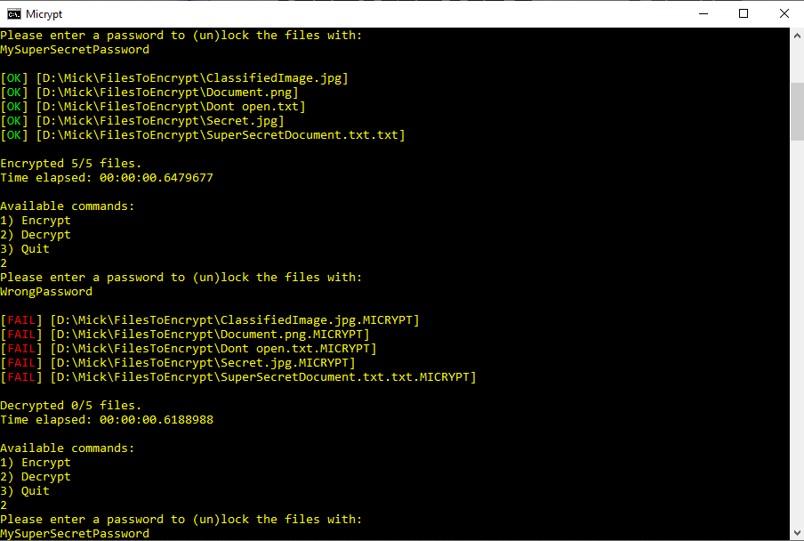

# MicryptCS

Command-line tool written in C# to lock a file with a password.
The encryption used is AES-256-CBC with a HMAC-SHA-256 to enforce integrity and authentication.

Generally a ciphermode like GCM is preferred over CBC + HMAC, but C# doesn't support GCM by default.
There is a library([BouncyCastle](https://www.bouncycastle.org/csharp/index.html)) available that supports GCM as ciphermode, but documentation is basically non-existent.

### Warning!
Use this tool and/or code at your own risk.
This tool was developed as a project to gain more knowledge about cryptograhy.

### Usage

1. `MicryptCS [filePath]`. *Example: `MicryptCS C:/MyUsername/MyImportantFiles`*
2. Choose a command by entering a valid number.
3. Enter a password to encrypt/decrypt the files with.

## ScreenShots

1. Starting Micrypt and supplying a file path

2. Choosing the encryption command and entering a password

3. Result of the encryption

4. Choosing the decryption command and entering the **wrong** password

5. Result of the decryption with the **wrong** password

6. Choosing the decryption command and entering the **correct** password

7. Result of the decryption with the **correct** password

